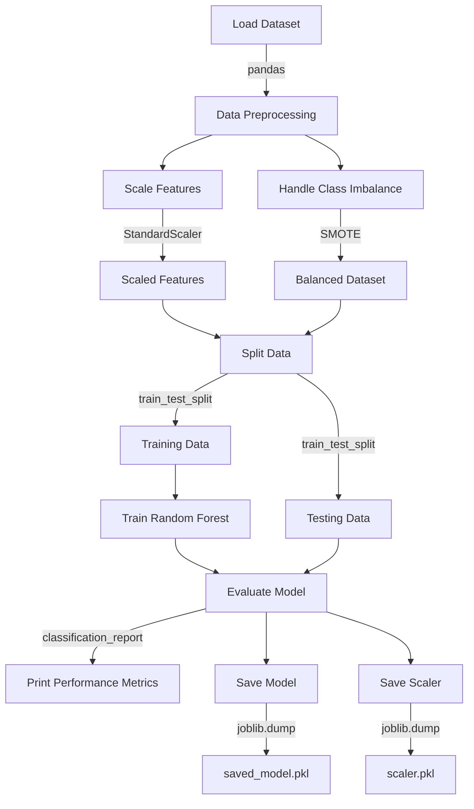

## 1. Clone the Repository
``` git clone https://github.com/Raza-husain/credit-card-fraud-detection ```

## 2. Dataset Integration
This project uses data from Kaggle. Follow these steps to add the dataset:

1. Create a Kaggle account if you don't have one
2. Download the dataset from https://www.kaggle.com/datasets/kartik2112/fraud-detection
3. Create a `data` folder in your project root
4. Extract the downloaded dataset into the `data` folder

### Kaggle API Method
Alternatively, you can use the Kaggle API:

``` python
import kagglehub

path = kagglehub.dataset_download("kartik2112/fraud-detection")

print("Path to dataset files:", path)
```

## 3. Environment Setup
### Create a virtual environment
    python -m venv venv

### Virtual environment 
For Windows
``` venv\Scripts\activate ```

For Unix or MacOS
``` source venv/bin/activate ```

Install required packages
``` pip install -r requirements.txt ```


## 4. Flowchart for the project



## Usage
1. Start the local server
2. Navigate to `http://localhost:your_port`

### Dependencies
- HTML5
- CSS3
- JavaScript

### Contributing
1. Fork the repository
2. Create your feature branch (`git checkout -b feature/AmazingFeature`)
3. Commit your changes (`git commit -m 'Add some AmazingFeature'`)
4. Push to the branch (`git push origin feature/AmazingFeature`)
5. Open a Pull Request


### Acknowledgments
- Kaggle for providing the dataset

## Contact
Your Name - Raza Abidi  <br />
Email - razaabidi030@gmail.com  <br />
Twitter - https://x.com/Razardus1  <br />
Instagram - https://www.instagram.com/raza.abidii/  <br />
Linkedin - https://www.linkedin.com/in/raza-abidi-53675020b/  <br />
